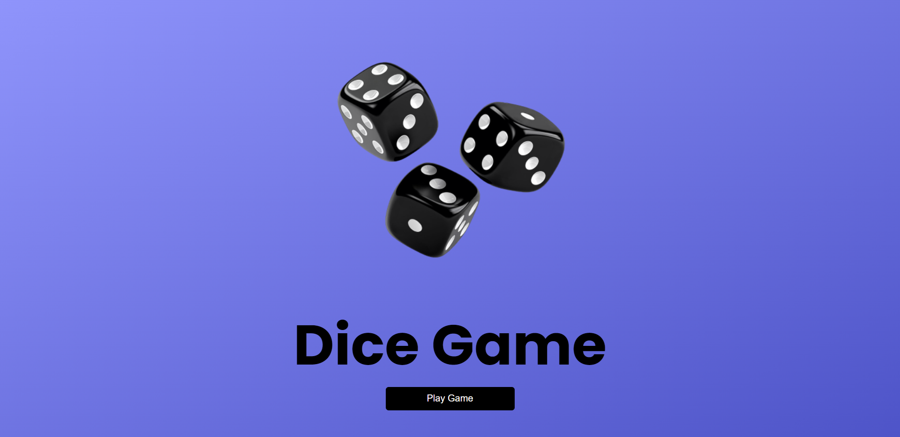
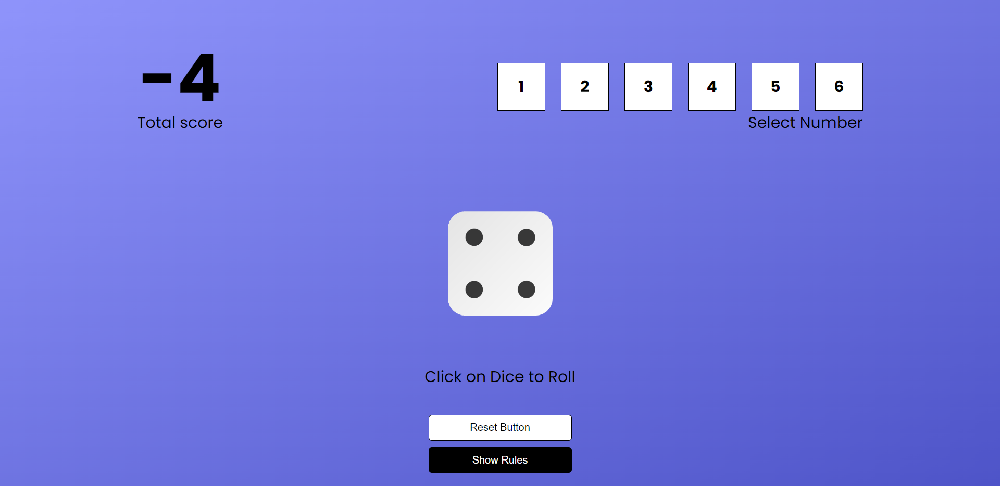
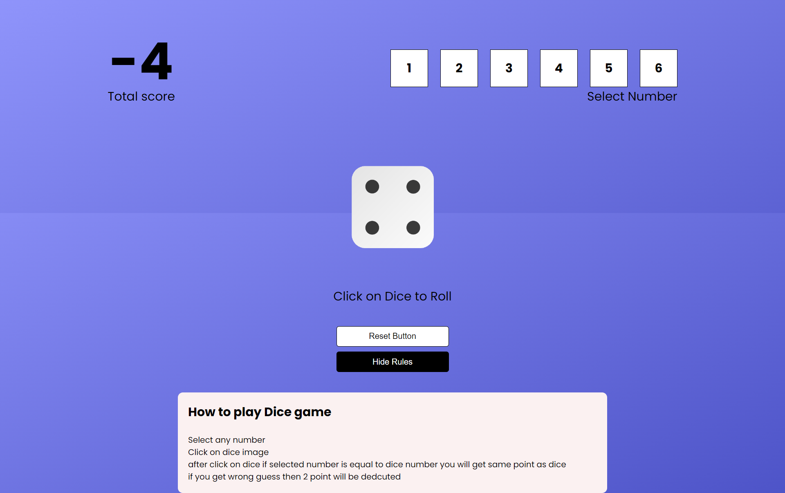

# Dice Game 🎲

## Overview

Dice Game is a simple and fun React-based game where players predict the outcome of a dice roll. The goal is to match the player's selected number with the dice's random outcome to score points. If the prediction is correct, the player gains points. If incorrect, points are deducted.

## Features

- **React Components**: Built using functional components and various React features like `useState`.
- **Styled Components**: Styled components are used for styling the UI, ensuring a modular and scalable CSS approach.
- **Interactive Gameplay**: Players can select a number from 1 to 6 and roll the dice to test their luck.
- **Score System**: Gain points for correct predictions, and lose points for incorrect ones.

## Technologies Used

- **React**: For building the user interface and managing game state.
- **JavaScript (ES6)**: Core logic for the game.
- **Styled Components**: CSS-in-JS for component-level styling.
- **React Hooks**: `useState` for managing state in functional components.

## How to Play

1. Select a number between 1 and 6.
2. Click the "Roll Dice" image.
3. If your selected number matches the dice roll, you earn points.
4. If not, 2 points will be deducted.

## Screenshots

## Demo

[React Weather App](https://dhruv06122002.github.io/Dice-Game/)

## Future Improvements

- Adding multiple rounds with increasing difficulty.
- Implementing a leaderboard to track high scores.
- Adding sound effects for rolling and scoring.

## License

This project is licensed under the MIT License. Feel free to use and modify the code for your own purposes.

## Acknowledgments

Special thanks to the React and Styled Components communities for their excellent resources and support.
